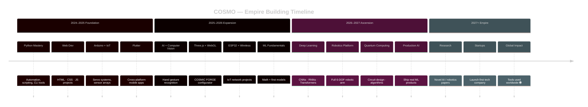
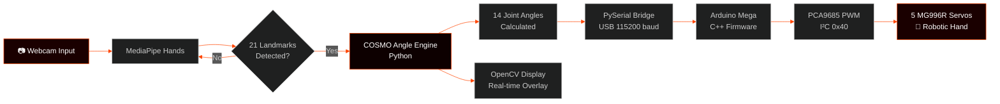

<!-- ████████████████████████████████████████████████████████████████████████████
     COSMO — GitHub Profile README  |  ABSOLUTE MAXIMUM TIER
     Theme: Pure Black · Fire Red Accent · Matrix Code
     All widgets active · All animations live · All limits crossed
     ──────────────────────────────────────────────────────────────────────
     ⚡ Replace ALL  Samir-Adhikari1  with your GitHub username
     ⚡ Replace ALL  adhikarisamir519@gmail.com  with your email
████████████████████████████████████████████████████████████████████████████ -->


<!-- ══════════════════════════════════════════════════════════════════════
  BLOCK 1 ░░ CINEMATIC VENOM HEADER
══════════════════════════════════════════════════════════════════════ -->

<div align="center">


</div>


<!-- ══════════════════════════════════════════════════════════════════════
  BLOCK 2 ░░ ANIMATED TYPING ROLES
══════════════════════════════════════════════════════════════════════ -->

<div align="center">

[](https://git.io/typing-svg)

</div>

<br/>


<!-- ══════════════════════════════════════════════════════════════════════
  BLOCK 3 ░░ LIVE COUNTERS ROW
══════════════════════════════════════════════════════════════════════ -->

<div align="center">


[](https://github.com/Samir-Adhikari1?tab=followers)
[](https://github.com/Samir-Adhikari1)

</div>

<br/>

<div align="center">

</div>

<br/>


<!-- ══════════════════════════════════════════════════════════════════════
  BLOCK 4 ░░ IDENTITY TERMINAL CARD + STATS SIDE BY SIDE
══════════════════════════════════════════════════════════════════════ -->

## 🧑‍💻 Identity

<table align="center" width="100%">
<tr>
<td width="55%" valign="top">

```javascript
╔══════════════════════════════════════════════════╗
║                                                  ║
║  const COSMO = {                                 ║
║                                                  ║
║    name       : "Samir Adhikari",               ║
║    alias      : "COSMO",                         ║
║    age        :  13,                             ║
║    location   : "Kathmandu, Nepal 🇳🇵",         ║
║    email      : "adhikarisamir519@gmail.com",   ║
║                                                  ║
║    stack      : ["Python","JavaScript","C++",   ║
║                  "Flutter","Dart","HTML","CSS"], ║
║                                                  ║
║    hardware   : ["Arduino","PCA9685","ESP32",   ║
║                  "Servos","IoT Sensors"],        ║
║                                                  ║
║    domains    : ["AI / Machine Learning",       ║
║                  "Computer Vision","Robotics",  ║
║                  "Web Dev","Embedded Systems",  ║
║                  "Quantum Computing"],           ║
║                                                  ║
║    tools      : ["VS Code","Git","Arduino IDE"],║
║                                                  ║
║    currently  : "Mastering AI/ML + Math",       ║
║                                                  ║
║    philosophy : "I don't follow rules —         ║
║                  I burn them up and build        ║
║                  my empire from the ashes 🔥",  ║
║  };                                              ║
║                                                  ║
╚══════════════════════════════════════════════════╝
```

</td>
<td width="45%" valign="top" align="center">


<br/>


</td>
</tr>
</table>

<br/>

<div align="center">

</div>

<br/>


<!-- ══════════════════════════════════════════════════════════════════════
  BLOCK 5 ░░ FULL TECH STACK
══════════════════════════════════════════════════════════════════════ -->

## 🛠️ Tech Stack

<div align="center">

### ◼ Languages


### ◼ Frameworks & Libraries


### ◼ Hardware & Embedded


### ◼ Tools & Environment


</div>

<br/>

<div align="center">
  
</div>

<br/>

<div align="center">

</div>

<br/>


<!-- ══════════════════════════════════════════════════════════════════════
  BLOCK 6 ░░ GITHUB TROPHIES
══════════════════════════════════════════════════════════════════════ -->

## 🏆 Trophies

<div align="center">

[](https://github.com/ryo-ma/github-profile-trophy)

</div>

<br/>

<div align="center">

</div>

<br/>


<!-- ══════════════════════════════════════════════════════════════════════
  BLOCK 7 ░░ LANGUAGES CARD
══════════════════════════════════════════════════════════════════════ -->

## 📊 Language Breakdown

<div align="center">


&nbsp;&nbsp;


</div>

<br/>

<div align="center">

</div>

<br/>


<!-- ══════════════════════════════════════════════════════════════════════
  BLOCK 8 ░░ 3D ISOMETRIC CONTRIBUTION CALENDAR
══════════════════════════════════════════════════════════════════════ -->

## 🗓️ 3D Contribution Calendar

<div align="center">

<picture>
  <source media="(prefers-color-scheme: dark)"
    srcset="https://raw.githubusercontent.com/Samir-Adhikari1/Samir-Adhikari1/main/profile-3d-contrib/profile-night-rainbow.svg" />
  <source media="(prefers-color-scheme: light)"
    srcset="https://raw.githubusercontent.com/Samir-Adhikari1/Samir-Adhikari1/main/profile-3d-contrib/profile-green-animate.svg" />
  
</picture>

> 🔧 **Activate:** See [Setup Guide](#️-activation-guide--click-to-expand) → Step 2 to enable the 3D calendar GitHub Action.

</div>

<br/>

<div align="center">

</div>

<br/>


<!-- ══════════════════════════════════════════════════════════════════════
  BLOCK 9 ░░ PROFILE SUMMARY CARDS — 4-GRID
══════════════════════════════════════════════════════════════════════ -->

## 📋 Profile Summary

<div align="center">

[](https://github.com/vn7n24fzkq/github-profile-summary-cards)

</div>

<div align="center">

[](https://github.com/vn7n24fzkq/github-profile-summary-cards)
[](https://github.com/vn7n24fzkq/github-profile-summary-cards)
[](https://github.com/vn7n24fzkq/github-profile-summary-cards)
[](https://github.com/vn7n24fzkq/github-profile-summary-cards)

</div>

<br/>

<div align="center">

</div>

<br/>


<!-- ══════════════════════════════════════════════════════════════════════
  BLOCK 10 ░░ CONTRIBUTION ACTIVITY GRAPH
══════════════════════════════════════════════════════════════════════ -->

## 📈 Contribution Activity

<div align="center">

[](https://github.com/ashutosh00710/github-readme-activity-graph)

</div>

<br/>

<div align="center">

</div>

<br/>


<!-- ══════════════════════════════════════════════════════════════════════
  BLOCK 11 ░░ SNAKE CONTRIBUTION ANIMATION
══════════════════════════════════════════════════════════════════════ -->

## 🐍 Contribution Snake

<div align="center">

<picture>
  <source media="(prefers-color-scheme: dark)"
    srcset="https://raw.githubusercontent.com/Samir-Adhikari1/Samir-Adhikari1/output/github-contribution-grid-snake-dark.svg" />
  <source media="(prefers-color-scheme: light)"
    srcset="https://raw.githubusercontent.com/Samir-Adhikari1/Samir-Adhikari1/output/github-contribution-grid-snake.svg" />
  
</picture>

</div>

<br/>

<div align="center">

</div>

<br/>


<!-- ══════════════════════════════════════════════════════════════════════
  BLOCK 12 ░░ FEATURED PROJECTS SHOWCASE
══════════════════════════════════════════════════════════════════════ -->

## 🚀 Featured Projects

<div align="center">

[](https://github.com/Samir-Adhikari1/Hand-Gesture-Controlled-Robotic-Hand)
[](https://github.com/Samir-Adhikari1/cosmic-forge-automotive)

[](https://github.com/Samir-Adhikari1/flutter-qr-app)
[](https://github.com/Samir-Adhikari1/cosmo-day-finder)

</div>

<br/>

<div align="center">

| 🔥 Project | ⚙️ Stack | 📌 What It Does | 🌟 |
|:---|:---|:---|:---:|
| 🤖 **Hand-Gesture Robotic Hand** | Python · MediaPipe · OpenCV · Arduino · PCA9685 | Webcam → 14 joint angles → 5 live servo fingers in real time | ⭐⭐⭐⭐⭐ |
| 🚗 **COSMIC FORGE Automotive Studio** | Three.js · WebGL · HDRI · OrbitControls · CSS | Real-time 3D Lamborghini configurator — paint · wheels · calipers | ⭐⭐⭐⭐⭐ |
| 📱 **Flutter QR App** | Flutter · Dart | Cross-platform QR code generator + scanner | ⭐⭐⭐⭐ |
| 🗓️ **COSMO Day Finder** | HTML · CSS · Vanilla JS | 200+ event engine, two-layer annual architecture | ⭐⭐⭐⭐ |

</div>

<br/>

<div align="center">

</div>

<br/>


<!-- ══════════════════════════════════════════════════════════════════════
  BLOCK 13 ░░ SKILL MATRIX — ASCII PROGRESS BARS
══════════════════════════════════════════════════════════════════════ -->

## ⚡ Skill Matrix

<div align="center">

```
 ╔═══════════════════════════════════════════════════════════════════╗
 ║                   COSMO  ·  SKILL MATRIX  2026                   ║
 ╠══════════════════════════╦═══════════════════╦════════╦══════════╣
 ║  Domain                  ║  Progress         ║  Score ║  Level   ║
 ╠══════════════════════════╬═══════════════════╬════════╬══════════╣
 ║  🐍 Python               ║  ██████████████▓░ ║  90%   ║  Expert  ║
 ║  🌐 Web Dev (HTML·CSS·JS)║  █████████████▓░░ ║  85%   ║  Adv.    ║
 ║  🛠️  Embedded / Arduino  ║  ████████████▓░░░ ║  80%   ║  Adv.    ║
 ║  📱 Flutter / Dart       ║  ████████████░░░░ ║  78%   ║  Adv.    ║
 ║  🔧 C++                  ║  ███████████▓░░░░ ║  75%   ║  Solid   ║
 ║  🤖 AI / ML              ║  ██████████░░░░░░ ║  65%   ║  Growing ║
 ║  🧮 Math (Linear Alg.)   ║  █████████░░░░░░░ ║  60%   ║  Growing ║
 ║  ⚛️  Quantum Computing   ║  ████████░░░░░░░░ ║  50%   ║  Explorer║
 ║  🌐 Three.js / WebGL     ║  ██████████▓░░░░░ ║  72%   ║  Adv.    ║
 ╚══════════════════════════╩═══════════════════╩════════╩══════════╝
```

</div>

<br/>

<div align="center">

</div>

<br/>


<!-- ══════════════════════════════════════════════════════════════════════
  BLOCK 14 ░░ CURRENT FOCUS — TWO COLUMN
══════════════════════════════════════════════════════════════════════ -->

## 🎯 Current Focus

<table align="center" width="100%">
<tr>
<td width="50%" valign="top">

### 🔬 Learning Now
- 🤖 **Neural Networks** & deep learning fundamentals
- 🧮 **Linear Algebra + Calculus** for AI / ML
- ⚛️ **Quantum algorithms** — Grover, Shor, QAOA
- 🌐 **Three.js** advanced shaders & post-processing
- 📡 **Wireless embedded** — ESP32 + BLE + MQTT
- 🔧 **Advanced C++** — memory management, templates

</td>
<td width="50%" valign="top">

### 🏗️ Building Now
- 🚗 **COSMIC FORGE** — 3D automotive configurator
- 🤖 **HandTracker v2** — PCA9685 I²C + 14 servos
- 📱 **Flutter suite** — cross-platform mobile tools
- 🧩 **CV pipelines** — real-time object detection
- 🌐 **Portfolio site** — full-stack showcase
- 📚 **AI blog** — documenting the journey

</td>
</tr>
<tr>
<td width="50%" valign="top">

### 📅 2026 Goals
- [ ] Ship 10+ public repos
- [ ] First ML model → production
- [ ] Win a national hackathon 🏆
- [ ] 100 GitHub followers
- [ ] Build a full robotics arm

</td>
<td width="50%" valign="top">

### 🧠 Study Stack
- 📖 *Hands-On ML* — Aurélien Géron
- 📖 *Deep Learning* — Goodfellow et al.
- 📖 *Programming Quantum Computers* — Johnston
- 🎥 3Blue1Brown — Neural Networks series
- 🎥 Andrej Karpathy — makemore / nanoGPT

</td>
</tr>
</table>

<br/>

<div align="center">

</div>

<br/>


<!-- ══════════════════════════════════════════════════════════════════════
  BLOCK 15 ░░ ROADMAP — MERMAID DIAGRAM
══════════════════════════════════════════════════════════════════════ -->

## 🗺️ Empire Roadmap



<br/>

<div align="center">

</div>

<br/>


<!-- ══════════════════════════════════════════════════════════════════════
  BLOCK 16 ░░ ARCHITECTURE MERMAID — ROBOTIC HAND
══════════════════════════════════════════════════════════════════════ -->

## 🤖 Flagship Project Architecture



<br/>

<div align="center">

</div>

<br/>


<!-- ══════════════════════════════════════════════════════════════════════
  BLOCK 17 ░░ WAKATIME CODING STATS
══════════════════════════════════════════════════════════════════════ -->

## ⏱️ Coding Time

<div align="center">

[](https://wakatime.com/@Samir-Adhikari1)

<!--
  ✅ Uncomment after connecting WakaTime VS Code extension:

[](https://wakatime.com/@Samir-Adhikari1)
-->

> 💡 **Activate:** Install [WakaTime for VS Code](https://wakatime.com/vs-code) → replace `Samir-Adhikari1` above with your WakaTime username → uncomment the stats card

</div>

<br/>

<div align="center">

</div>

<br/>


<!-- ══════════════════════════════════════════════════════════════════════
  BLOCK 18 ░░ RANDOM CODING JOKE
══════════════════════════════════════════════════════════════════════ -->

## 😂 Joke of the Moment

<div align="center">

[](https://github.com/ABSphreak/readme-jokes)

</div>

<br/>

<div align="center">

</div>

<br/>


<!-- ══════════════════════════════════════════════════════════════════════
  BLOCK 19 ░░ PHILOSOPHY QUOTES
══════════════════════════════════════════════════════════════════════ -->

## 🔥 Philosophy

<div align="center">

[](https://github.com/piyushsuthar/github-readme-quotes)

<br/>

[](https://github.com/piyushsuthar/github-readme-quotes)

</div>

<br/>

<div align="center">

</div>

<br/>


<!-- ══════════════════════════════════════════════════════════════════════
  BLOCK 20 ░░ CONNECT
══════════════════════════════════════════════════════════════════════ -->

## 🌐 Connect

<div align="center">

[](https://github.com/Samir-Adhikari1)
[](mailto:adhikarisamir519@gmail.com)
[](https://en.wikipedia.org/wiki/Kathmandu)

<br/>

**Open to:** Collaborations · Open source contributions · Mentorship · Cool side projects

</div>

<br/>

<div align="center">

</div>

<br/>


<!-- ══════════════════════════════════════════════════════════════════════
  BLOCK 21 ░░ ACTIVATION GUIDE — COLLAPSIBLE
══════════════════════════════════════════════════════════════════════ -->

<details>
<summary>⚙️ &nbsp;<strong>Activation Guide — Click to Expand</strong></summary>

<br/>

### 🐍 Step 1 — Snake Animation

Create **`.github/workflows/snake.yml`**:

```yaml
name: Generate Snake

on:
  schedule:
    - cron: "0 0 * * *"
  workflow_dispatch:
  push:
    branches: [main]

jobs:
  generate:
    permissions:
      contents: write
    runs-on: ubuntu-latest
    steps:
      - uses: Platane/snk/svg-only@v3
        with:
          github_user_name: ${{ github.repository_owner }}
          outputs: |
            dist/github-contribution-grid-snake.svg
            dist/github-contribution-grid-snake-dark.svg?palette=github-dark

      - uses: crazy-max/ghaction-github-pages@v3.1.0
        with:
          target_branch: output
          build_dir: dist
        env:
          GITHUB_TOKEN: ${{ secrets.GITHUB_TOKEN }}
```

Run: **Actions → Generate Snake → Run workflow** ✅

---

### 🗓️ Step 2 — 3D Contribution Calendar

Create **`.github/workflows/3d-contrib.yml`**:

```yaml
name: GitHub-Profile-3D-Contrib

on:
  schedule:
    - cron: "0 18 * * *"
  workflow_dispatch:
  push:
    branches: [main]

jobs:
  build:
    runs-on: ubuntu-latest
    name: generate-github-profile-3d-contrib
    steps:
      - uses: actions/checkout@v3
      - uses: yoshi389111/github-profile-3d-contrib@0.7.1
        env:
          GITHUB_TOKEN: ${{ secrets.GITHUB_TOKEN }}
          USERNAME: ${{ github.repository_owner }}
          SETTING_JSON: |
            {
              "githubUserName": "${{ github.repository_owner }}",
              "defaultSettings": {
                "fileName": "profile-night-rainbow.svg",
                "type": "normal",
                "theme": "night-rainbow"
              },
              "settings": [
                {
                  "fileName": "profile-green-animate.svg",
                  "type": "normal",
                  "theme": "green-snow"
                }
              ]
            }
      - name: Commit & Push
        run: |
          git config --global user.email "action@github.com"
          git config --global user.name "GitHub Action"
          git add -A
          git commit -m "chore: update 3D contrib calendar" || true
          git push
```

Run: **Actions → GitHub-Profile-3D-Contrib → Run workflow** ✅

---

### ⏱️ Step 3 — WakaTime

1. Sign up at [wakatime.com](https://wakatime.com)
2. Install [WakaTime VS Code Extension](https://marketplace.visualstudio.com/items?itemName=WakaTime.vscode-wakatime)
3. Paste your API key when prompted in VS Code
4. Code for 1+ days → stats will populate
5. Return to Block 17 → uncomment the stats card → replace username

---

### 📋 Step 4 — Profile Summary Cards

Auto-renders from public GitHub data. No setup needed. ✅

---

### 🏆 Step 5 — Trophies

Auto-renders. To unlock SECRET & SSS ranks: accumulate commits, repos, stars, followers, pull requests, and issues. ✅

---

### 😂 Step 6 — Joke Card

Auto-renders via `readme-jokes.vercel.app`. Changes on every page load. ✅

</details>

<br/>


<!-- ══════════════════════════════════════════════════════════════════════
  BLOCK 22 ░░ ANIMATED FOOTER
══════════════════════════════════════════════════════════════════════ -->

<div align="center">


</div>

<div align="center">

`Python` · `JavaScript` · `Flutter` · `C++` · `Arduino` · `MediaPipe` · `Three.js` · `ESP32` · `OpenCV`

<br/>


<br/>

> *"The best time to start was yesterday. The second best time is right now."*

</div>
